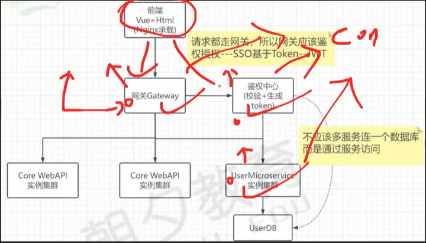

# 项目学习笔记汇总

## 微服务架构代码结构分析

### 一、整体架构概览

```text
Plaid.MSACommerce/                          # .NET 8 微服务电商解决方案
│
├── gateways/                               # 【网关层】
│   └── Plaid.MSACommerce.WebGateway/       #   Ocelot API 网关
│
├── apps/                                   # 【应用服务层】
│   └── Plaid.MSACommerce.AuthServer/       #   认证授权服务 (JWT Token 颁发)
│
├── services/                               # 【微服务层】
│   └── user/src/                           #   用户微服务
│       ├── Plaid.MSACommerce.UserService.HttpApi/        # ① 表示层 (API 入口)
│       ├── Plaid.MSACommerce.Uservice.UseCases/          # ② 应用层 (CQRS 用例)
│       ├── Plaid.MSACommerce.Uservice.Core/              # ③ 领域层 (实体/领域模型)
│       └── Plaid.MSACommerce.Uservice.Infrastructure/    # ④ 基础设施层 (数据库/工具)
│
├── shared/                                 # 【共享库层】
│   ├── Plaid.MSACommerce.SharedKernel/                    # 共享内核 (DDD 基类)
│   ├── Plaid.MSACommerce.UseCases.Common/                # 用例公共 (验证/异常)
│   ├── Plaid.MSACommerce.Infrastructure.EntityFrameworkCore/ # EF Core 公共 (审计拦截器)
│   └── Plaid.MSACommerce.HttpApi.Common/                 # HTTP API 公共 (控制器基类)
│
├── pakages/                                # 【自定义 NuGet 包】
│   ├── Plaid.MSACommerce.Consul/                          # Consul 服务注册与发现
│   ├── Plaid.MSACommerce.Authentication.JwtBearer/        # JWT 认证
│   └── Plaid.MSACommerce.CommonServiceClient/             # 服务客户端 + 负载均衡
│
└── Plaid.MSACommerce.Infrastructure.Common/  # 公共基础设施 (统一 Consul 配置)
```

------

### 二、架构设计模式

该项目采用 **Clean Architecture（整洁架构）+ DDD（领域驱动设计）+ CQRS（命令查询职责分离）** 模式，核心依赖方向为：

```test
  表示层 ──→ 应用层 ──→ 领域层
    │          │
    └──────────┴──→ 基础设施层
```

------

### 三、各层详细分析

#### 1. 网关层 —— `gateways/Plaid.MSACommerce.WebGateway`

**作用**：整个微服务系统的统一入口，负责请求路由、负载均衡、服务发现。

| 文件                                                         | 路径                                    | 作用                                                         |
| ------------------------------------------------------------ | --------------------------------------- | ------------------------------------------------------------ |
| [Program.cs](file:///E:/资料/个人/Code/Plaid.MSACommerce/gateways/Plaid.MSACommerce.WebGateway/Program.cs) | gateways/.../Program.cs                 | 启动入口：配置 Ocelot 多文件合并、Consul 服务发现、JWT 验证、Swagger 聚合 |
| [IPConsulServiceBuilder.cs](file:///E:/资料/个人/Code/Plaid.MSACommerce/gateways/Plaid.MSACommerce.WebGateway/IPConsulServiceBuilder.cs) | gateways/.../IPConsulServiceBuilder.cs  | **自定义 Consul 服务发现构建器**：将 Ocelot 默认返回的主机名改为 IP 地址，解决本地开发无法通过主机名访问的问题 |
| [ocelot.global.json](file:///E:/资料/个人/Code/Plaid.MSACommerce/gateways/Plaid.MSACommerce.WebGateway/ocelot/ocelot.global.json) | gateways/.../ocelot/ocelot.global.json  | Ocelot 全局配置：网关地址 `localhost:5080`、Consul 服务发现地址 `localhost:8500` |
| [ocelot.apps.json](file:///E:/资料/个人/Code/Plaid.MSACommerce/gateways/Plaid.MSACommerce.WebGateway/ocelot/ocelot.apps.json) | gateways/.../ocelot/ocelot.apps.json    | AuthServer 路由配置：`/api/token/{path}` → AuthServer        |
| [ocelot.service.json](file:///E:/资料/个人/Code/Plaid.MSACommerce/gateways/Plaid.MSACommerce.WebGateway/ocelot/ocelot.service.json) | gateways/.../ocelot/ocelot.service.json | UserService 路由配置：`/api/user/*` → UserService，含 JWT 认证限制 |
| [ocelot.swagger.json](file:///E:/资料/个人/Code/Plaid.MSACommerce/gateways/Plaid.MSACommerce.WebGateway/ocelot/ocelot.swagger.json) | gateways/.../ocelot/ocelot.swagger.json | Swagger 聚合路由：将各服务 Swagger JSON 暴露到网关统一入口   |

**请求流转**：

```
客户端 → 网关(localhost:5080) → Ocelot 路由匹配 → Consul 服务发现 → 下游微服务
```

------

#### 2. 应用服务层 —— `apps/Plaid.MSACommerce.AuthServer`

**作用**：认证授权中心，负责验证用户身份并颁发 JWT Token。

| 文件                                                         | 作用                                                         |
| ------------------------------------------------------------ | ------------------------------------------------------------ |
| [Program.cs](file:///E:/资料/个人/Code/Plaid.MSACommerce/apps/Plaid.MSACommerce.AuthServer/Program.cs) | 启动入口：注册 Consul 服务、健康检查、Swagger                |
| [TokenController.cs](file:///E:/资料/个人/Code/Plaid.MSACommerce/apps/Plaid.MSACommerce.AuthServer/Controllers/TokenController.cs) | `GET /api/token?username=&password=` 接收用户名密码，调用身份服务生成 JWT |
| [IIdentityService.cs](file:///E:/资料/个人/Code/Plaid.MSACommerce/apps/Plaid.MSACommerce.AuthServer/Services/IIdentityService.cs) | 身份认证接口                                                 |
| [IdentityService.cs](file:///E:/资料/个人/Code/Plaid.MSACommerce/apps/Plaid.MSACommerce.AuthServer/Services/IdentityService.cs) | **核心认证逻辑**：通过 Refit 调用 UserService 验证用户 → 构建 JWT（含 Claims: NameIdentifier, Name, MobilePhone）→ 返回 Token |
| [IUserService.cs](file:///E:/资料/个人/Code/Plaid.MSACommerce/apps/Plaid.MSACommerce.AuthServer/Services/IUserService.cs) | Refit 接口定义：`GET /api/user?username=&password=` 调用用户服务 |
| [UserServiceClient.cs](file:///E:/资料/个人/Code/Plaid.MSACommerce/apps/Plaid.MSACommerce.AuthServer/Clients/UserServiceClient.cs) | **服务客户端实现**：继承 `ServiceClient`，通过 Consul 服务发现 + 负载均衡获取 UserService 地址，创建 Refit 代理 |
| [JwtSettings.cs](file:///E:/资料/个人/Code/Plaid.MSACommerce/apps/Plaid.MSACommerce.AuthServer/JwtSettings.cs) | JWT 配置类（Issuer, Audience, Secret, 过期时间等）           |

**认证流程**：

```
TokenController → IdentityService → UserServiceClient(Refit) → Consul服务发现 → UserService
     ↓
生成 JWT Token → 返回给客户端
```

------

#### 3. 用户微服务四层架构 —— `services/user/src/`

##### ③ 领域层（Core）—— `Plaid.MSACommerce.Uservice.Core`

**作用**：DDD 的核心，定义业务实体和领域规则，**不依赖任何外部框架**。

| 文件                                                         | 作用                                                         |
| ------------------------------------------------------------ | ------------------------------------------------------------ |
| [TbUser.cs](file:///E:/资料/个人/Code/Plaid.MSACommerce/services/user/src/Plaid.MSACommerceUservice.Core/Entites/TbUser.cs) | 用户聚合根实体：继承 `BaseAuditEntity`（含 Id, CreatedAt, LastModifiedAt），实现 `IAggregateRoot`。属性：Username, Password, Phone, Salt |
| [DataSchemaConstants.cs](file:///E:/资料/个人/Code/Plaid.MSACommerce/services/user/src/Plaid.MSACommerceUservice.Core/DataSchemaConstants.cs) | 数据架构约定常量：用户名最大长度 32、密码 6~128、手机号 11、盐 32 |

**依赖关系**：仅依赖 `Plaid.MSACommerce.SharedKernel`

------

##### ② 应用层（UseCases）—— `Plaid.MSACommerce.Uservice.UseCases`

**作用**：实现 CQRS 模式的命令和查询，编排业务用例，**不包含业务逻辑，只做协调**。

| 文件                                                         | 作用                                                         |
| ------------------------------------------------------------ | ------------------------------------------------------------ |
| [CreateUser.cs](file:///E:/资料/个人/Code/Plaid.MSACommerce/services/user/src/Plaid.MSACommerceUservice.UseCases/Commands/CreateUser.cs) | **创建用户命令**：`CreateUserCommand` (record) → `CreateUserCommandValidator` (FluentValidation 验证) → `CreateUserCommandHanlder` (MediatR 处理器)：检查用户名唯一性 → MD5+盐加密 → 保存到数据库 |
| [GetUser.cs](file:///E:/资料/个人/Code/Plaid.MSACommerce/services/user/src/Plaid.MSACommerceUservice.UseCases/Queries/GetUser.cs) | **查询用户命令**：`GetUserQuery` → `GetQuestionQueryValidator` → `GetUserQueryHandler`：查询用户 → 验证密码 → 返回 `UserDto` |
| [MappingProfile.cs](file:///E:/资料/个人/Code/Plaid.MSACommerce/services/user/src/Plaid.MSACommerceUservice.UseCases/MappingProfile.cs) | AutoMapper 映射配置：`CreateUserCommand → TbUser`、`TbUser → UserDto` |
| [DependencyInjection.cs](file:///E:/资料/个人/Code/Plaid.MSACommerce/services/user/src/Plaid.MSACommerceUservice.UseCases/DependencyInjection.cs) | DI 注册：调用 `AddUseCaseCommon` 一次性注册 AutoMapper + FluentValidation + MediatR |

**依赖关系**：依赖 Core + Infrastructure + UseCases.Common

------

##### ④ 基础设施层（Infrastructure）—— `Plaid.MSACommerce.Uservice.Infrastructure`

**作用**：处理数据库访问、ORM 配置、工具类等**技术细节**。

| 文件                                                         | 作用                                                         |
| ------------------------------------------------------------ | ------------------------------------------------------------ |
| [UserDbContext.cs](file:///E:/资料/个人/Code/Plaid.MSACommerce/services/user/src/Plaid.MSACommerceUservice.Infrastructure/Data/UserDbContext.cs) | EF Core 数据库上下文：`DbSet<TbUser>`，通过 `ApplyConfigurationsFromAssembly` 自动加载实体配置 |
| [TbUserConfiguration.cs](file:///E:/资料/个人/Code/Plaid.MSACommerce/services/user/src/Plaid.MSACommerceUservice.Infrastructure/Data/Configuration/TbUserConfiguration.cs) | **Fluent API 配置**：映射表名 `tb_user`、列名（id, username, password, phone, salt）、唯一约束（Username）、注释 |
| [MD5Helper.cs](file:///E:/资料/个人/Code/Plaid.MSACommerce/services/user/src/Plaid.MSACommerceUservice.Infrastructure/Tools/MD5Helper.cs) | MD5 加密工具：`MD5EncodingOnly`（纯 MD5）、`MD5EncodingWithSalt`（带盐 MD5，格式：`MD5(content + "{" + salt + "}")`） |
| [DependencyInjection.cs](file:///E:/资料/个人/Code/Plaid.MSACommerce/services/user/src/Plaid.MSACommerceUservice.Infrastructure/DependencyInjection.cs) | DI 注册：调用 `AddInfrastructureCommon`（Consul 注册）+ `AddInfrastructureEfCore`（审计拦截器）+ 配置 MySQL 数据库连接 + 注入 `AuditEntityInterceptor` |

**依赖关系**：依赖 Core + Infrastructure.EFCore + Infrastructure.Common

------

##### ① 表示层（HttpApi）—— `Plaid.MSACommerce.UserService.HttpApi`

**作用**：ASP.NET Core Web API 控制器，接收 HTTP 请求并委派给应用层。

| 文件                                                         | 作用                                                         |
| ------------------------------------------------------------ | ------------------------------------------------------------ |
| [Program.cs](file:///E:/资料/个人/Code/Plaid.MSACommerce/services/user/src/Plaid.MSACommerce.UserService.HttpApi/Program.cs) | 启动入口：按顺序注册 `Infrastructure → UseCases → HttpApi → Controllers → JwtBearer`，使用 `UseHttpCommon` 统一中间件 |
| [UserController.cs](file:///E:/资料/个人/Code/Plaid.MSACommerce/services/user/src/Plaid.MSACommerce.UserService.HttpApi/Controllers/UserController.cs) | 用户控制器：`GET /api/user`（查询用户）、`POST /api/user`（创建用户），继承 `ApiControllerBase`，通过 `Sender.Send()` 发送 MediatR 命令 |
| [DependencyInjection.cs](file:///E:/资料/个人/Code/Plaid.MSACommerce/services/user/src/Plaid.MSACommerce.UserService.HttpApi/DependencyInjection.cs) | 注册 HttpApi 层服务                                          |

**请求流转**：

```
HTTP Request → UserController → MediatR Sender.Send()
    → ValidationBehavior (FluentValidation 验证)
    → CommandHandler/QueryHandler (业务处理)
    → EF Core DbContext → MySQL
    → Result<T> → ApiControllerBase.ReturnResult() → HTTP Response
```

------

#### 4. 共享库层 —— `shared/`

##### 4.1 共享内核 —— [Plaid.MSACommerce.SharedKernel](file:///E:/资料/个人/Code/Plaid.MSACommerce/shared/Plaid.MSACommerce.SharedKernel)

**作用**：DDD 基础类型定义，所有层共享，**不依赖任何外部框架**。

| 文件                                                         | 作用                                                         |
| ------------------------------------------------------------ | ------------------------------------------------------------ |
| [IEntity.cs](file:///E:/资料/个人/Code/Plaid.MSACommerce/shared/Plaid.MSACommerce.SharedKernel/Domain/IEntity.cs) | 实体接口 `IEntity<TId>`，定义主键 Id                         |
| [BaseEntity.cs](file:///E:/资料/个人/Code/Plaid.MSACommerce/shared/Plaid.MSACommerce.SharedKernel/Domain/BaseEntity.cs) | 实体基类：实现 `IEntity<TId>`，内置领域事件集合 `_domainEvents`（`[NotMapped]`，不映射到数据库） |
| [BaseAuditEntity.cs](file:///E:/资料/个人/Code/Plaid.MSACommerce/shared/Plaid.MSACommerce.SharedKernel/Domain/BaseAuditEntity.cs) | 审计实体基类：继承 `BaseEntity<long>`，新增 `CreatedAt`、`LastModifiedAt`（`DateTimeOffset` 带时区） |
| [AuditwithUserEntity.cs](file:///E:/资料/个人/Code/Plaid.MSACommerce/shared/Plaid.MSACommerce.SharedKernel/Domain/AuditwithUserEntity.cs) | 带用户审计实体：继承 `BaseAuditEntity`，新增 `CreateBy`、`LastModifiedBy` |
| [IAggregateRoot.cs](file:///E:/资料/个人/Code/Plaid.MSACommerce/shared/Plaid.MSACommerce.SharedKernel/Domain/IAggregateRoot.cs) | 聚合根标记接口                                               |
| [BaseEvent.cs](file:///E:/资料/个人/Code/Plaid.MSACommerce/shared/Plaid.MSACommerce.SharedKernel/Domain/BaseEvent.cs) | 领域事件基类：实现 `INotification`（MediatR），记录事件发生时间 |
| [ICommand.cs](file:///E:/资料/个人/Code/Plaid.MSACommerce/shared/Plaid.MSACommerce.SharedKernel/Messaging/ICommand.cs) | CQRS 命令接口：`ICommand<TResponse> : IRequest<TResponse>`   |
| [IQuery.cs](file:///E:/资料/个人/Code/Plaid.MSACommerce/shared/Plaid.MSACommerce.SharedKernel/Messaging/IQuery.cs) | CQRS 查询接口：`IQuery<TResponse> : IRequest<TResponse>`     |
| [Result.cs](file:///E:/资料/个人/Code/Plaid.MSACommerce/shared/Plaid.MSACommerce.SharedKernel/Result/Result.cs) | **统一返回结果模式**：`Result<T>` 泛型结果 和 `Result` 非泛型结果。支持 `Success()`、`Failure()`、`NotFound()`、`Forbidden()`，含隐式转换 |

##### 4.2 用例公共层 —— [Plaid.MSACommerce.UseCases.Common](file:///E:/资料/个人/Code/Plaid.MSACommerce/shared/Plaid.MSACommerce.UseCases.Common)

**作用**：MediatR 管道行为、异常定义、用户接口抽象。

| 文件                                                         | 作用                                                         |
| ------------------------------------------------------------ | ------------------------------------------------------------ |
| [ValidationBehavior.cs](file:///E:/资料/个人/Code/Plaid.MSACommerce/shared/Plaid.MSACommerce.UseCases.Common/Behaviors/ValidationBehavior.cs) | **MediatR 管道验证行为**：`IPipelineBehavior<TRequest, TResponse>`，在命令/查询处理前自动执行 FluentValidation 验证。验证失败抛出 `ValidationException` |
| [ValidationException.cs](file:///E:/资料/个人/Code/Plaid.MSACommerce/shared/Plaid.MSACommerce.UseCases.Common/Exceptions/ValidationException.cs) | 自定义验证异常                                               |
| [ForbiddenException.cs](file:///E:/资料/个人/Code/Plaid.MSACommerce/shared/Plaid.MSACommerce.UseCases.Common/Exceptions/ForbiddenException.cs) | 自定义禁止访问异常                                           |
| [IUser.cs](file:///E:/资料/个人/Code/Plaid.MSACommerce/shared/Plaid.MSACommerce.UseCases.Common/Interfaces/IUser.cs) | 用户信息接口抽象（Id, Username）                             |
| [DependencyInjection.cs](file:///E:/资料/个人/Code/Plaid.MSACommerce/shared/Plaid.MSACommerce.UseCases.Common/DependencyInjection.cs) | **核心 DI 注册**：`AddUseCaseCommon` 一次性注册 AutoMapper + FluentValidation + MediatR（含 `ValidationBehavior` 管道行为） |

##### 4.3 EF Core 公共层 —— [Plaid.MSACommerce.Infrastructure.EntityFrameworkCore](file:///E:/资料/个人/Code/Plaid.MSACommerce/shared/Plaid.MSACommerce.Infrastructure.EntityFrameworkCore)

| 文件                                                         | 作用                                                         |
| ------------------------------------------------------------ | ------------------------------------------------------------ |
| [AuditEntityInterceptor.cs](file:///E:/资料/个人/Code/Plaid.MSACommerce/shared/Plaid.MSACommerce.Infrastructure.EntityFrameworkCore/Interceptors/AuditEntityInterceptor.cs) | **审计拦截器**：继承 `SaveChangesInterceptor`，在 `SaveChanges` 时自动填充 `CreatedAt`、`LastModifiedAt`、`CreateBy`、`LastModifiedBy` |

##### 4.4 HTTP API 公共层 —— [Plaid.MSACommerce.HttpApi.Common](file:///E:/资料/个人/Code/Plaid.MSACommerce/shared/Plaid.MSACommerce.HttpApi.Common)

| 文件                                                         | 作用                                                         |
| ------------------------------------------------------------ | ------------------------------------------------------------ |
| [ApiControllerBase.cs](file:///E:/资料/个人/Code/Plaid.MSACommerce/shared/Plaid.MSACommerce.HttpApi.Common/Infrastructure/ApiControllerBase.cs) | **控制器基类**：所有 Controller 继承它。提供 `Sender`（MediatR ISender 实例）和 `ReturnResult()`（统一将 `Result` 转换为 HTTP 响应：200/204/400/404/403） |
| [UseCaseExceptionHandler.cs](file:///E:/资料/个人/Code/Plaid.MSACommerce/shared/Plaid.MSACommerce.HttpApi.Common/Infrastructure/UseCaseExceptionHandler.cs) | **全局异常处理器**：`IExceptionHandler`，将 `ValidationException` → 400 + 错误详情，`ForbiddenException` → 403 |
| [CurrentUser.cs](file:///E:/资料/个人/Code/Plaid.MSACommerce/shared/Plaid.MSACommerce.HttpApi.Common/Services/CurrentUser.cs) | 当前用户服务：从 `HttpContext.User`（JWT Claims）中提取 `Id` 和 `Username` |
| [AppBuilderExtensions.cs](file:///E:/资料/个人/Code/Plaid.MSACommerce/shared/Plaid.MSACommerce.HttpApi.Common/AppBuilderExtensions.cs) | **统一中间件入口**：`UseHttpCommon()` 一次性注册 健康检查 + 认证 + 授权 + 异常处理 |

------

#### 5. 自定义 NuGet 包 —— `pakages/`

##### 5.1 Consul 包 —— [Plaid.MSACommerce.Consul](file:///E:/资料/个人/Code/Plaid.MSACommerce/pakages/Plaid.MSACommerce.Consul)

| 文件                                                         | 作用                                                         |
| ------------------------------------------------------------ | ------------------------------------------------------------ |
| [ConsulServiceRegistrationExtensions.cs](file:///E:/资料/个人/Code/Plaid.MSACommerce/pakages/Plaid.MSACommerce.Consul/ServiceRegistration/ConsulServiceRegistrationExtensions.cs) | **服务注册**：将微服务注册到 Consul，配置健康检查 URL（`http://host:port/health`）、检查间隔、超时、自动注销时间 |
| [ConsulServiceDiscovery.cs](file:///E:/资料/个人/Code/Plaid.MSACommerce/pakages/Plaid.MSACommerce.Consul/ServiceDiscovery/ConsulServiceDiscovery.cs) | **服务发现**：通过 Consul 健康检查接口获取指定服务名的所有健康实例地址列表 |
| [ServiceConfiguration.cs](file:///E:/资料/个人/Code/Plaid.MSACommerce/pakages/Plaid.MSACommerce.Consul/ServiceRegistration/ServiceConfiguration.cs) | 服务配置模型                                                 |
| [ServiceCheckConfiguration.cs](file:///E:/资料/个人/Code/Plaid.MSACommerce/pakages/Plaid.MSACommerce.Consul/ServiceRegistration/ServiceCheckConfiguration.cs) | 健康检查配置模型                                             |

##### 5.2 JWT 认证包 —— [Plaid.MSACommerce.Authentication.JwtBearer](file:///E:/资料/个人/Code/Plaid.MSACommerce/pakages/Plaid.MSACommerce.Authentication.JwtBearer)

| 文件                                                         | 作用                                                         |
| ------------------------------------------------------------ | ------------------------------------------------------------ |
| [DependencyInjection.cs](file:///E:/资料/个人/Code/Plaid.MSACommerce/pakages/Plaid.MSACommerce.Authentication.JwtBearer/DependencyInjection.cs) | **JWT 验证服务注册**：配置 `TokenValidationParameters`（验证签发者、受众、过期时间、签名密钥），关闭 5 分钟容错窗口 |

##### 5.3 服务客户端包 —— [Plaid.MSACommerce.CommonServiceClient](file:///E:/资料/个人/Code/Plaid.MSACommerce/pakages/Plaid.MSACommerce.CommonServiceClient)

| 文件                                                         | 作用                                                         |
| ------------------------------------------------------------ | ------------------------------------------------------------ |
| [ServiceClient.cs](file:///E:/资料/个人/Code/Plaid.MSACommerce/pakages/Plaid.MSACommerce.CommonServiceClient/ServiceClient.cs) | **服务客户端基类**：构造函数中通过 Consul 服务发现 + 负载均衡器获取目标服务地址，设置 `HttpClient.BaseAddress` |
| [LoadBalancer.cs](file:///E:/资料/个人/Code/Plaid.MSACommerce/pakages/Plaid.MSACommerce.CommonServiceClient/LoadBalancer.cs) | 负载均衡器实现                                               |
| [RoundRobinStrategy.cs](file:///E:/资料/个人/Code/Plaid.MSACommerce/pakages/Plaid.MSACommerce.CommonServiceClient/Strategies/RoundRobinStrategy.cs) | **轮询策略**：`Interlocked.Increment` 原子操作保证线程安全，按顺序轮流分配节点 |
| [RandomStrategy.cs](file:///E:/资料/个人/Code/Plaid.MSACommerce/pakages/Plaid.MSACommerce.CommonServiceClient/Strategies/RandomStrategy.cs) | **随机策略**：随机选取一个可用节点                           |

------

##### 6. 公共基础设施 —— [Plaid.MSACommerce.Infrastructure.Common](file:///E:/资料/个人/Code/Plaid.MSACommerce/Plaid.MSACommerce.Infrastructure.Common)

| 文件                                                         | 作用                                                         |
| ------------------------------------------------------------ | ------------------------------------------------------------ |
| [DependencyInjection.cs](file:///E:/资料/个人/Code/Plaid.MSACommerce/Plaid.MSACommerce.Infrastructure.Common/DependencyInjection.cs) | **统一 Consul 注册**：`AddInfrastructureCommon` 方法封装了 Consul 客户端的注册和服务注册逻辑，所有微服务可复用 |

------

### 四、核心依赖关系图

```
                        ┌──────────────────────────────┐
                        │  Plaid.MSACommerce.WebGateway │  ← Ocelot + Consul + JWT
                        │  (网关 :5080)                 │
                        └─────────────┬────────────────┘
                                      │ 路由转发
              ┌───────────────────────┼───────────────────────┐
              ▼                       ▼                       ▼
   ┌──────────────────┐   ┌──────────────────────┐   ┌──────────────────┐
   │  AuthServer      │   │  UserService.HttpApi  │   │  其他微服务...    │
   │  (认证服务)       │   │  (用户服务 :5000)      │   │                  │
   └────────┬─────────┘   └──────────┬───────────┘   └──────────────────┘
            │                        │
            │  Refit 调用             │
            └────────────────────────┘
                     │
                     ▼
   ┌──────────────────────────────────────────────┐
   │  Plaid.MSACommerce.CommonServiceClient       │
   │  (Consul服务发现 + 负载均衡)                   │
   └──────────────────────────────────────────────┘
                     │
                     ▼
   ┌──────────────────────────────────────────────┐
   │  Consul Server (localhost:8500)              │
   │  (服务注册中心)                                │
   └──────────────────────────────────────────────┘
```

------

### 五、核心技术栈

| 类别          | 技术                                     | 用途                       |
| ------------- | ---------------------------------------- | -------------------------- |
| 框架          | .NET 8                                   | 运行时                     |
| 网关          | Ocelot + Ocelot.Provider.Consul          | API 网关 + Consul 服务发现 |
| 认证          | JWT Bearer                               | 无状态身份认证             |
| 服务注册/发现 | Consul                                   | 微服务注册与健康检查       |
| 数据库        | MySQL + Pomelo.EntityFrameworkCore.MySql | 数据持久化                 |
| ORM           | Entity Framework Core                    | 数据库操作                 |
| 中介者模式    | MediatR                                  | CQRS 命令/查询分发         |
| 验证          | FluentValidation                         | 请求参数验证               |
| 对象映射      | AutoMapper                               | 实体 ↔ DTO 映射            |
| HTTP 客户端   | Refit                                    | 声明式 HTTP 调用           |
| 负载均衡      | 自实现（轮询/随机）                      | 服务间调用负载均衡         |

------

### 六、请求完整流转示例（以"创建用户"为例）

```
1. 客户端 POST /api/user {"username":"test","password":"123456"}
        │
2. 网关 Ocelot 路由匹配 → Consul 发现 UserService 实例
        │
3. UserController.Create(CreateUserCommand)
        │
4. MediatR 管道:
   └─ ValidationBehavior: FluentValidation 验证参数
        │
5. CreateUserCommandHanlder.Handle():
   ├─ 检查用户名唯一性 (dbContext.TbUser.AnyAsync)
   ├─ MD5Helper.MD5EncodingOnly(用户名) → 生成 Salt
   ├─ MD5Helper.MD5EncodingWithSalt(密码, Salt) → 加密密码
   ├─ dbContext.TbUser.Add(user)
   └─ dbContext.SaveChangesAsync()
        │
6. AuditEntityInterceptor 拦截 SaveChanges:
   └─ 自动填充 CreatedAt, LastModifiedAt
        │
7. Result.Success() → ApiControllerBase.ReturnResult()
        │
8. HTTP 200 → 客户端
```

------

这就是整个项目的完整代码架构分析。整个项目采用 **Clean Architecture + DDD + CQRS** 模式，层次分明，职责清晰，依赖方向严格向内（领域层不依赖任何外部框架），是一套比较规范的 .NET 微服务架构实现。


## 技术点梳理

### 前后端通信跨域问题

跨域：不同的域之间进行数据交互或操作(同一个域就是相同的域名或IP地址)

浏览器：同源策略(核心的安全机制)=》来自于相同源的脚本才能操作页面元素；(同源URL:主机名/域名/IP,端口号，网络协议;)

解决方案：跨域资源共享==CORS==W3C制定一个标准

​	L两个角色：资源提供



响应问题：跨域是由网关响应还是服务响应，谁响应谁处理跨域问题，所以在微服务中不管是网关还是服务都需要去处理跨域问题

#### 解决跨域问题

1. Ocelot网关：它本身就已经配置好解决跨域问题，只需要在UpstreamHttpMethod(网关中配置请求策略)中增加"OPTIONS"表示允许预检请求，这样关于相关跨域的请求才会被放回到后端对应的服务上，如不添加则关于跨域的请求会本Ocelot网关拦截掉
2. 在依赖注入中增加Cors跨域配置

   ~~~c#
/// <summary>
///1. 通过CORS策略允许所有请求,包括OPTIONS请求,从而解决跨域问题
/// </summary>
/// <param name="services"></param>
private static void ConfigureCors(IServiceCollection services)
{
    services.AddCors(options =>
    {
        options.AddPolicy("Allowany", builder =>
        {
            builder.AllowAnyOrigin()
                .AllowAnyMethod()
                .AllowAnyHeader();
        });
    });
}
//2.配置启动项中的扩展方法中增加
 ConfigureCors(services);

//3.管道中间件中添加跨域策略AllowAny
app.UseCors("AllowAny");


//注:其他的服务中如果直接在共享类库中ApiControllerBase中直接去写公共的跨域策略配置
//由于所有的控制器WebApi都继承自ApiControllerBase  并且将共享类库中的HttpApi.Common加载到自己的启动入口中；所以带着将跨域的配置加载进去了，单独的服务需要向上面那样自己去写跨域配置策略
   ~~~

### 访问令牌

#### 访问令牌的弊端和刷新令牌的作用

访问令牌==》过期时间固定==》所带来的问题是

1. 恶意攻击获取到JWT令牌，可以再令牌过期之前可以获取受保护的资源从而增加安全风险
2. 对于违规用户限制登录了，令牌无法立即生效

访问令牌的有效期很短==几分钟，会存在一个问题当令牌过期了用户就需要重新进行身份验证(用户会进行频繁的身份认证不仅会干扰用户的使用，还有其他的问题)